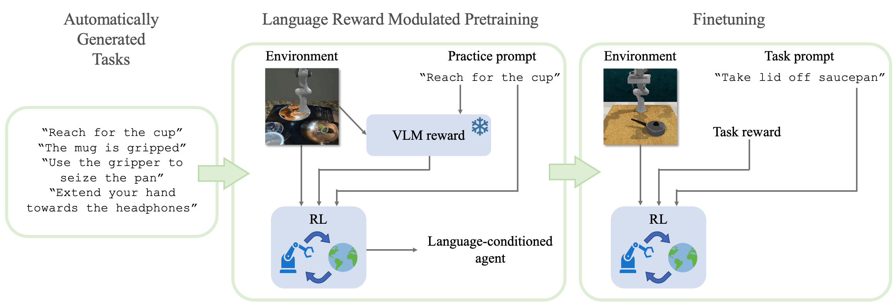

# LAMP

**LA**nguage **M**odulated **P**retraining (LAMP💡) is a method for pretraining a general RL agent for accelerated downstream learning by augmenting unsupervised RL rewards with extrinsic rewards parameterized by a Video-Langauge Model (VLM).



## Installation
To create a conda environment called `lamp`: 
```bash
conda env create -f env.yml
conda activate lamp
```

Then, follow the RLBench installation instructions from [this fork](https://github.com/ademiadeniji/RLBench_lamp) that implements shaped rewards and the domain-randomized pretraining environment.

Finally, install [our fork](https://github.com/ademiadeniji/r3m_lamp) of the R3M module that enables computing video-language alignment scores.

```bash
git clone https://github.com/ademiadeniji/r3m_lamp
pip install -e r3m_lamp
```

## Training
To pretrain your LAMP agent run:

```bash
TF_CPP_MIN_LOG_LEVEL=0 CUDA_VISIBLE_DEVICES=0 TF_XLA_FLAGS=--tf_xla_auto_jit=2 vglrun -d :0.0 python train.py --logdir /YOUR/LOGDIR/HERE --task pick_shapenet_objects --seed 1 --use_r3m_reward True --device cuda:0 --vidlang_model_device cuda:0 --use_lang_embeddings True --configs front_wrist vlsp --curriculum.objects 'bag,bowl,cap,earphone,faucet,jar,knife,laptop,mug,pot,telephone' --curriculum.num_unique_per_class '-1' --curriculum.num_objects '3' --curriculum.lang_prompt 'prompts/similar_verb_40.txt' --curriculum.synonym_folder prompts/similar_noun --curriculum.num_episodes '20000' --randomize True --expl_intr_scale 0.9 --expl_extr_scale 0.1 --plan2explore True
```

To finetune your pretrained LAMP agent on the take lid off saucepan task run:

```bash
TF_CPP_MIN_LOG_LEVEL=0 CUDA_VISIBLE_DEVICES=0 TF_XLA_FLAGS=--tf_xla_auto_jit=2 vglrun -d :0.0 python train.py --logdir /YOUR/LOGDIR/HERE --task take_lid_off_saucepan --seed 0 --device cuda:0 --vidlang_model_device cuda:0 --use_lang_embeddings True --configs front_wrist vlsp --curriculum.use False --critic_linear_probe True --loaddir [LOADDIR] --ts [NUM_STEPS_PRETRAINED] --plan2explore True --expl_intr_scale 0 --expl_extr_scale 1 --shaped_rewards True
```
